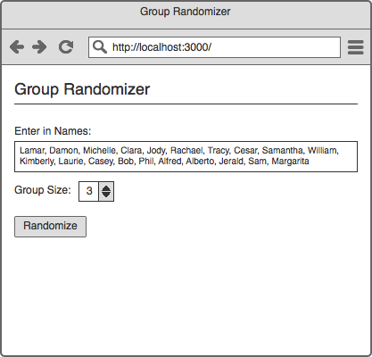
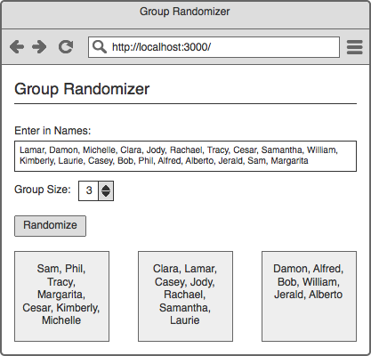

## Group Randomizer

Build an front-end AngularJS application that allows you to input a list of people and then randomly and evenly groups people into a specified size.

[Here's a website](http://www.aschool.us/random/random-pair.php) that does something similar to what is being asked of you.


### Inputs & Outputs

Example inputs:

```js
var people = [ 'Hoa', 'Bell', 'Jaye', 'Lura', 'Elroy', 'Dann', 'Avery' ];
var groupSize = 3;
```

Example output:

```js
var output = [
  [ 'Bell', 'Elroy' ],
  [ 'Avery', 'Dann' ],
  [ 'Hoa', 'Lura', 'Jaye' ]
];
```

Note that in the above example there are not enough people to evenly split the group but the additional person is still allocated to a group.


### Potential Mockups






### Additional Features

* Allow for the names to be entered in various ways. For example, comma separated or all names entered on a new line.

* When the groups are displayed, have them visually and evenly share the page. That is, if two groups are desired each group listing shows half of the page; if four groups are desired, each group takes up a quarter of the page.

* Add validation to the form so that there must be more names than the number of groups desired.

* Allow for someone to upload a CSV instead of typing names in manually. You can use a library like [Papa Parse](http://papaparse.com/).

* Add a separate input that corresponds to the number of groups called "Categories". When groups are randomized, randomize the category names to each group. For example, if you wanted three groups your "Categories" might be Red, Blue, and Green.

* For the above feature, add validation so that the number of groups present must match the inputted number.

* Add the ability to "Choose a Leader" where one person within each group is randomly selected to be the leader of the group.

* Use [Local Storage](https://developer.mozilla.org/en-US/docs/Web/API/Window/localStorage) to save the list of people so that when a user returns to the page, their list re-populates in the text box.
